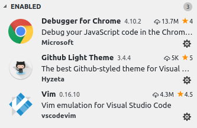

# electronjs-and-p5js

My personal note to make a simple combination of Electron.js and p5.js.

## Writer

* SJ Kim
* bus710@gmail.com
  
----

## Index  
  
- Get Node.js  
- Get Visual Studio Code
- Kick Off
- Put some code for the files
- Get some required modules
- Debugging the main process with vscode
  
## Get Node.js  
  
Node is the framework we have to use and I would like to try the current version (node-v10.11.0-x64.msi as of 2018/09).  
- https://nodejs.org/en/download/current/
- After downloading, just run the executable.
  
## Get Visual Studio Code (vscode)
  
Vsode became so popular as a proper IDE for various projects.
- https://code.visualstudio.com/
- After downloding, just run the executable as well.
- I prefer couple extensions but as you like.  
  
           
   
  
## Kick Off

I referred couple of repos:  
- https://electronjs.org/docs/tutorial/first-app  
- https://github.com/garciadelcastillo/p5js-electron-templates

The steps are:
  
- Before run vscode, make a folder (I made a folder "Test" in my Desktop).
- Then run vscode and open the folder just made.
- And make couple of files like:  
    - package.json  
    - index.html  
    - style.css  
    - main.js  
    - renderer.js  
    - and sketch.js  
  
## Put some code for the files

Write contents for the files.  
  
For package.json
```
{
  "name": "test",
  "version": "1.0.0",
  "description": "A minimal Electron application",
  "main": "main.js",
  "scripts": {
    "start": "electron ."
  },
  "repository": "",
  "keywords": [
    "Electron",
    "p5.js"
  ],
  "author": "GitHub",
  "license": "CC0-1.0"
}
```

For index.html
```
<!DOCTYPE html>
<html>

<head>
  <meta charset="UTF-8">
  <title>Hello World!</title>
  <script language="javascript" type="text/javascript" src="./node_modules/p5/lib/p5.js"></script>
  <script language="javascript" type="text/javascript" src="./sketch.js"></script>
  <style> ::-webkit-scrollbar { display: none; } </style>  
  <link rel="stylesheet" type="text/css" href="style.css">
</head>

<body>
</body>

<script>
  require('./renderer.js')
</script>
</html>
```

For syle.css
```
body {
    padding: 0; 
    margin: 0; 
    background: #000000; 
    overflow-x:hidden; 
    overflow-y: hidden
}
```

For main.js
```
const { app, BrowserWindow } = require('electron')
let win
  
function createWindow () {    
  win = new BrowserWindow({ 
      resizable: false,
      width: 800, 
      height: 600 })
  win.setMenu(null);      
  win.loadFile('index.html')
  win.webContents.openDevTools()

  win.on('closed', () => {
    win = null
  })
}

app.on('ready', createWindow)

app.on('window-all-closed', () => {
  if (process.platform !== 'darwin') {
    app.quit()
  }
})

app.on('activate', () => {
  if (win === null) {
    createWindow()
  }
})
```
  
For renderer.js
```
myEmitter.on('event', () => {
    console.log('an event occurred!');
});

console.log("renderer!");
```
  
For sketch.js (Thanks to Garcia Del Castillo)
```
const EventEmitter = require('events');
class MyEmitter extends EventEmitter {}
const myEmitter = new MyEmitter();

const easerCount = 500
const easing = 0.05
const diameter = 10
let easer = []

console.log("sketch!")

function setup() {
    createCanvas(windowWidth, windowHeight)
    console.log(`${windowWidth}, ${windowHeight}`)
    noStroke()
    background(255)

    for (let i = 0; i < easerCount; i++) {
        let e = new Easer(width / 2, height / 2, diameter, easing)
        easer.push(e)
    }
}

function draw() {
    background(255)

    for (let i = 0; i < easer.length; i++) {
        easer[i].update()
        easer[i].render()
    }
}

function mousePressed() {
    for (let i = 0; i < easer.length; i++) {
        easer[i].setTarget(mouseX, mouseY)
    }
    myEmitter.emit('event');
}

function windowResized() {
    resizeCanvas(windowWidth, windowHeight)
}

function Easer(xpos, ypos, diameter, newEasing) {
    this.x = xpos
    this.y = ypos
    this.targetX = this.x
    this.targetY = this.y
    this.d = diameter
    this.ease = newEasing
    this.clr = color(random(0, 255), random(0, 255), random(0, 255), 127)

    this.render = function () {
        fill(this.clr)
        ellipse(this.x, this.y, this.d, this.d)
    }

    this.update = function () {
        let dx = this.targetX - this.x
        let dy = this.targetY - this.y
        if (abs(dx) > 0.1 || abs(dy) > 0.1) {
            this.x += dx * this.ease
            this.y += dy * this.ease
        } else {
            this.setRandomTarget()
        }
    }

    this.setTarget = function (xpos, ypos) {
        this.targetX = xpos
        this.targetY = ypos
    }

    this.setRandomTarget = function () {
        this.targetX = random(0, width)
        this.targetY = random(0, height)
    }
}
```

## Get some required modules

Start vscode's terminal by pressing **CTRL+\`**.

To get Electron.js:
```
$ npm install --save-dev electron
```

To get p5.js:
```
$ npm install --save p5
```

And finally:
```
$ npm start
```
  
## Debugging the main process with vscode
  
I referred a repo as below:  
https://electronjs.org/docs/tutorial/debugging-main-process-vscode  

In the **.vscode** directory under the root directory, a launch.json file needs to be made.  
Then,  
```
{
    "version": "0.2.0",
    "configurations": [
        {
            "name": "Debug Main Process",
            "type": "node",
            "request": "launch",
            "cwd": "${workspaceRoot}",
            "runtimeExecutable": "${workspaceRoot}/node_modules/.bin/electron",
            "windows": {
                "runtimeExecutable": "${workspaceRoot}/node_modules/.bin/electron.cmd"
            },
            "args": [
                "."
            ],
            "protocol": "inspector",
            "outputCapture": "std"
        }
    ]
}
```

Now, the debugging tab can show us a new menu to run the debugger (and the shortcut is F5).

## Tip for Windows
    
My original goal for this is connecting an external USB-CDC device to this electron application.  
Since Electron requires to compile some native packages (in my case serialport), electron-rebuild needs to be installed.
  
In the package.json file some sections were updated as below (this is not the entire file!).
```
{
  "scripts": {
    "start": "electron .",
    "install": "electron-rebuild"
  },
  "devDependencies": {
    "electron": "^3.0.2",
    "electron-rebuild": "^1.8.2"
  },
  "dependencies": {
    "p5": "^0.7.2",
    "serialport": "^7.0.2"
  }
}
```

Moreover, a global package has to be installed as well in case of Windows.
```
// In the admin level power shell
npm install -g --production windows-build-tools
```
  
After doing the above command, do npm install from the project's root.  
  
----

## Conclusion
  
This is a super simple process to have the minimal setting of the combination between Electron.js and p5.js.  
We saw from the installation of the framework and IDE.  
Also the minimum code to show the nice and dynamic canvas.  
Finally, based on the debugging feature we can develop the main process to interact with our system.  


